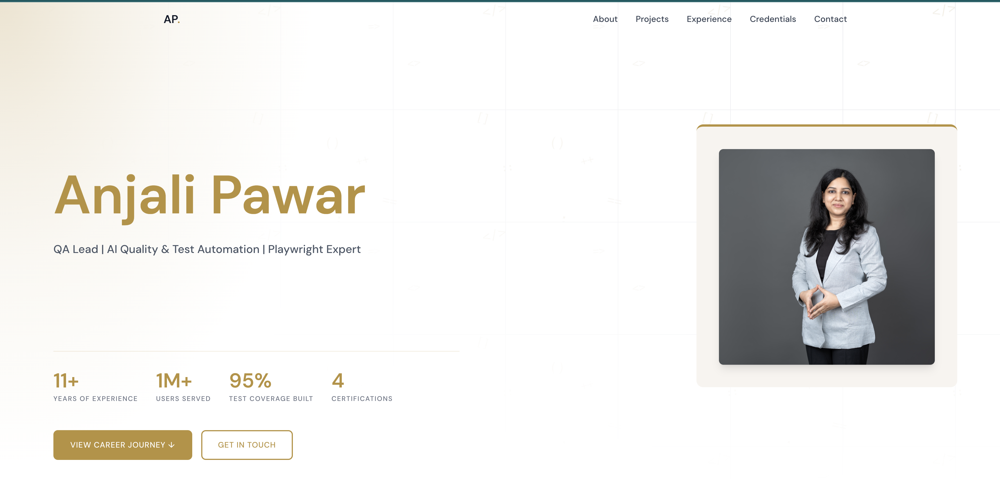

# anjalipawar.com

Personal portfolio of Anjali Pawar — Senior SDET, Automation Architect, and AI Quality Engineer with 12+ years of experience shipping quality at scale.

Live site: [anjalipawar.com](https://anjalipawar.com)

---


## About

This portfolio was built from scratch using AI-assisted development — collaborating with Claude by Anthropic to design content architecture, write technical copy, and make platform decisions. It demonstrates practical application of AI tools in a real engineering workflow.

## Built With

- [Astro](https://astro.build) — Static site generator
- [Tailwind CSS v4](https://tailwindcss.com) — Utility-first CSS
- TypeScript — Type-safe configuration
- GitHub Pages — Free static hosting
- Custom domain via GoDaddy

## Sections

- **Hero** — Name, title, stats, and quick links
- **About** — Career story and core expertise
- **Projects** — Real work with GitHub links
- **Experience** — Cornerstone OnDemand, EdCast, WAGmob
- **Credentials** — Certifications and education
- **Contact** — Email, LinkedIn, GitHub

## Local Development

```bash
git clone https://github.com/pawar-anjali/pawar-anjali.github.io.git
cd pawar-anjali.github.io
npm install
npm run dev
```

## Deployment

Deployed automatically via GitHub Actions on every push to `master`. Live at [anjalipawar.com](https://anjalipawar.com).

---

Built with intent. © 2026 Anjali Pawar
